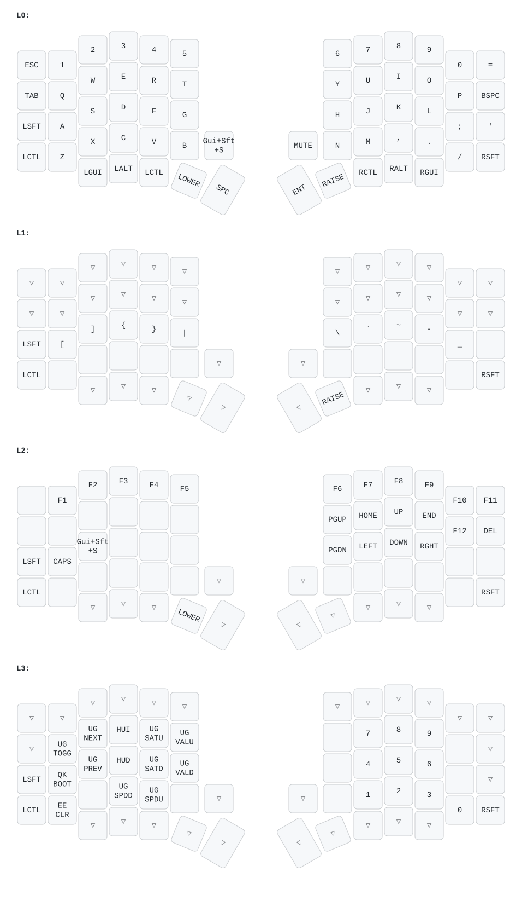

# Layout reference — keymap `valian` (Sofle RGB)

The authoritative, always-up-to-date visual is [`keymap.svg`](keymap.svg) (regenerated from `keymap.c` with keymap-drawer). This page describes the intent of each layer.



## Layers

| # | Layer | Access | Purpose |
|---|-------|--------|---------|
| 0 | `_BASE` | default | QWERTY + dedicated number row |
| 1 | `_LOWER` | hold left thumb (`LOWER`) | standard symbols |
| 2 | `_RAISE` | hold right thumb (`RAISE`) | F-keys + arrows + navigation |
| 3 | `_NUMPAD` | **tri-layer** (`LOWER`+`RAISE`) | lights/config (left) + numpad (right) |

`_NUMPAD` is enabled via `update_tri_layer(_LOWER, _RAISE, _NUMPAD)` — hold both layer keys.

## Modifiers (identical on every layer)

- **Shift** → home-row left pinky · **Ctrl** → bottom-row left pinky · **right Shift** → bottom-row right pinky.
- Thumbs: **GUI / Alt / Ctrl** (inherited from base on every layer).
- Right thumb is **AltGr** (Right Alt) for US-International: `AltGr + n = ñ`. Left thumb is normal Alt (e.g. paste images in Claude Code).
- **Caps Lock** = `RAISE + A` (the key next to the left Shift). There is no tap-dance, so Caps never triggers by accident.

## `_BASE`

QWERTY with `Esc` top-left and numbers `1-0` on the dedicated top row (handy for games). Backtick `` ` `` lives on `_LOWER`.

## `_LOWER` — symbols (same idea as the Corne)

The top row is the **number row with Shift, in order** (`! @ # $ %  ^ & * ( )`) — nothing new to learn. The "awkward" symbols move to the home row: `[ ] { } |` and `_ - + = \` plus backtick; `~` on the bottom row. The number row stays transparent (you keep `1-0`).

## `_RAISE` — F-keys + navigation

F1-F12 on the number row; **inverted-T arrows** on the right hand (`I`=↑, `J`=←, `K`=↓, `L`=→) with `Home/End/PgUp/PgDn` around them. `Caps Lock` sits next to the left Shift.

## `_NUMPAD` — lights/config + numpad

- **Right hand:** 10-key numpad (`7-8-9 / 4-5-6 / 1-2-3`, `0` next to `3`).
- **Left hand:** RGB/keyboard controls — toggle, hue/sat/val, effect mode/speed, `Boot` (jump to bootloader), `EEclr` (clear EEPROM).

## Encoders

| Layer | Rotate | Press |
|-------|--------|-------|
| `_BASE` | volume ↑/↓ | Mute |
| `_LOWER` | PgUp / PgDn | Mute |
| `_RAISE` | Ctrl+Tab / Ctrl+Shift+Tab | Mute |

## Per-layer RGB

`_BASE` dynamic hue (Hue+/Hue- on `_NUMPAD`) · `_LOWER` red · `_RAISE` green · `_NUMPAD` blue · Caps Lock on → gold (priority).

## OLED

- **Master:** dog animation (reacts to mods/caps) + active layer + HSV values.
- **Slave:** cat animation (continuous).
- Each half turns its OLED off after 60s without local key activity, back on with any keypress.

## Regenerate the diagram

```bash
export PYTHONUTF8=1
qmk c2json -kb sofle/rev1 -km valian --no-cpp -o sofle.json
keymap parse -q sofle.json > docs/keymap.yaml
keymap draw docs/keymap.yaml > docs/keymap.svg
```
